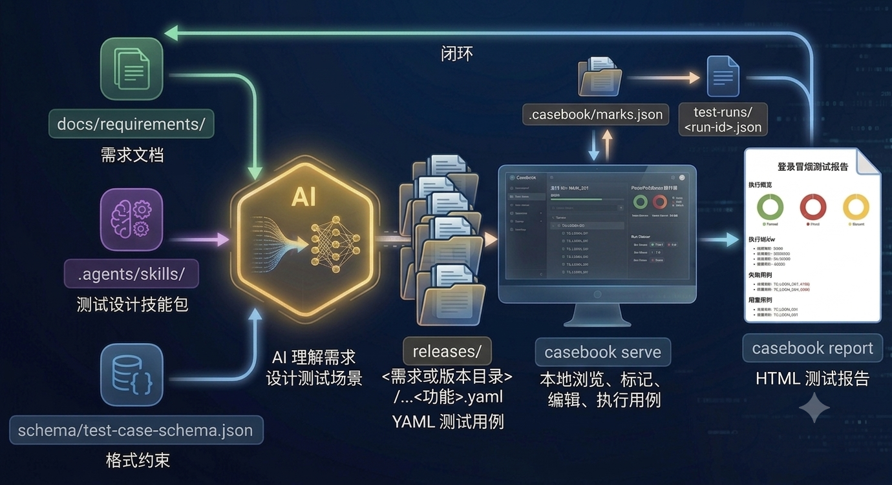
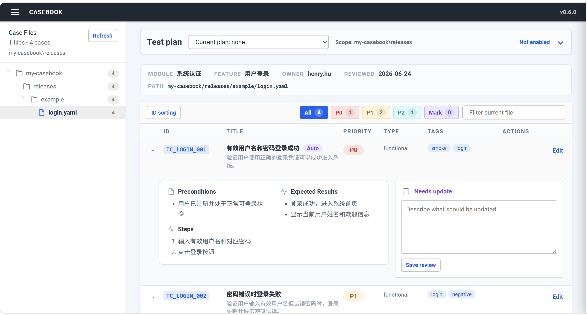
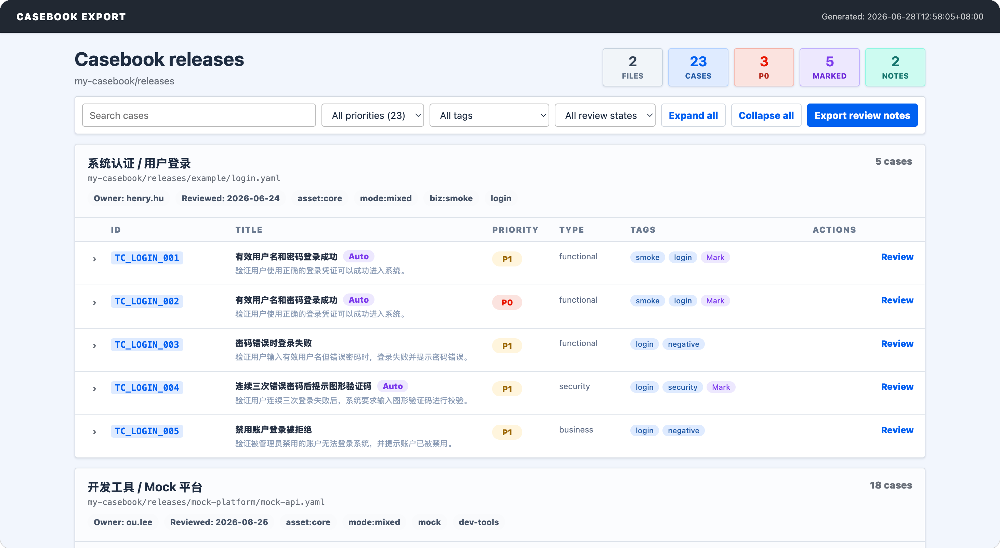
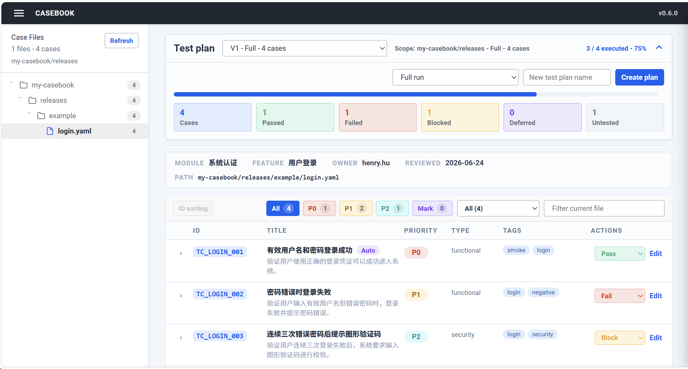
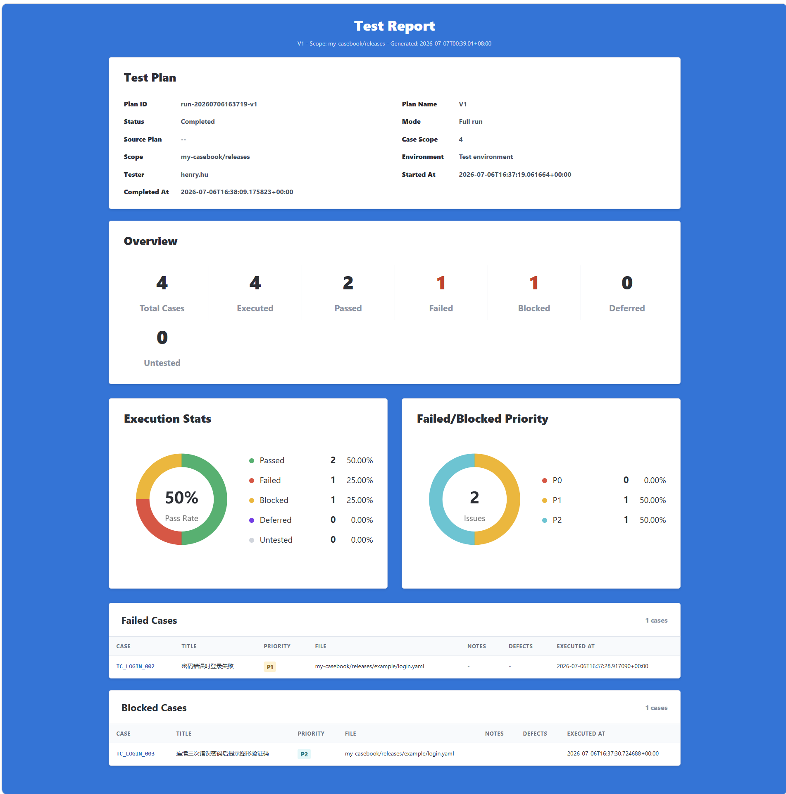

# Casebook

Casebook 是面向 AI Agent 时代的测试用例工程化工作流。

> 测试工程师应该使用 Lingma、Trae、Codex、Claude Code、Cursor 等 AI Agent 在项目中理解需求、生成用例、重构用例；Casebook 负责把这些工程化用例变成可以本地浏览、评审、标记、执行和生成报告的工作台。

Casebook 不是另一个测试用例管理平台，而是在 AI Agent 时代重新定义测试用例资产该如何被创建、维护和使用。

## 设计理念

传统测试用例管理的常见思路是：上传需求到平台，生成 XMind 或 Excel，用例再被下载、导入、复制、维护。即使接入了 AI，本质上仍然是把 AI 包装进平台流程里，测试用例依旧是孤立的表格资产。

Casebook 的设计从一开始就是 AI-native 的工程项目：

- 需求文档放在 `docs/requirements/`，成为 AI 理解业务的输入。
- 测试设计方法写进 `.agents/skills/`，让 AI 知道如何像测试人员一样设计用例。
- 用例结构由 `schema/test-case-schema.json` 约束，保证 AI 输出稳定可校验。
- YAML 用例存放在 `releases/`，可以被 Git 管理、Code Review、回滚和追踪。
- 评审标记、执行结果和报告数据独立保存，不污染用例定义。
- 本地 Web UI 只负责查看、评审、标记、轻量编辑、执行和报告，不试图替代 AI Agent 的生成能力。

因此，Casebook 不是把 AI 当作平台上的一个“生成按钮”，而是把 AI Agent 当作测试用例工程的主要生产力。


### Casebook 下的分工

- **🧑 人负责判断**：需求是否理解正确、风险是否覆盖充分、用例是否值得执行、失败是否真实有效。
- **🤖 AI Agent 负责生产**：读取需求和技能包，生成、补充、删除、重构 YAML 用例。
- **📐 Schema 负责约束**：保证用例结构稳定，降低 AI 输出漂移。
- **🌿 Git 负责协作**：让用例变成可审查、可追踪、可回滚的工程资产。
- **🧰 Casebook 负责工作台**：浏览、筛选、标记、轻量编辑、执行统计和报告生成。

## 完整工作流程

Casebook 推荐的流程是一个闭环：



```text
docs/requirements/ 需求文档
  + .agents/skills/ 测试设计技能包
  + schema/test-case-schema.json 格式约束
    -> AI Agent 理解需求并生成 YAML 用例
    -> releases/<需求或版本目录>/<功能>.yaml
    -> casebook export <需求或版本目录>
    -> 可分发的静态 HTML 评审/冒烟用例包
    -> casebook serve <需求或版本目录>
    -> 本地浏览、评审、标记、轻量编辑、执行
    -> .casebook/marks.json + test-runs/<run-id>.json
    -> casebook report <run-file>
    -> HTML 测试报告
```

这也是 Casebook 和一般AI测试用例平台最大的区别：

| 对比维度 | 一般 AI 测试用例平台 | Casebook |
| --- | --- | --- |
| 中心 | 测试管理平台 | Git 仓库 + AI Agent |
| AI 角色 | 生成用例文本的接口 | 理解需求、维护用例、重构资产的生产者 |
| 用例资产 | 平台数据库记录 | YAML 文件 |
| 需求资产 | 平台字段、附件、富文本 | `docs/requirements/` 中的 Markdown/文档 |
| 约束方式 | 平台表单和后端校验 | `schema/test-case-schema.json` |
| 协作方式 | 平台流程 | Git diff / PR / Code Review |
| 人的工作 | 填表、编辑、维护状态 | Review、判断、执行、验收 |
| 去掉 AI 后 | 平台仍完整运行 | Casebook 仍能浏览/执行，但用例生产和持续维护能力大幅下降 |

传统平台本质上是“人填数据，AI 辅助生成”。Casebook 本质上是“AI 维护工程资产，人做质量判断”。


## 安装


在本仓库中安装：

```bash
pip install casebook
```

安装后可以使用：

```bash
casebook --help
                                                                                              
 Usage: casebook [OPTIONS] COMMAND [ARGS]...                                                   
                                                                                               
 Render, review, and edit YAML test cases locally.                                             
                                                                                               
╭─ Options ───────────────────────────────────────────────────────────────────────────────────╮
│ --version          Show the Casebook version and exit.                                      │
│ --help             Show this message and exit.                                              │
╰─────────────────────────────────────────────────────────────────────────────────────────────╯
╭─ Commands ──────────────────────────────────────────────────────────────────────────────────╮
│ serve  Start the local Casebook web UI.                                                     │
│ init   Create a new Casebook test case project.                                             │
│ export Export YAML test cases to a standalone review HTML file.                             │
│ report Generate an HTML test report from a test run JSON file.                              │
│ renumber  Renumber test case IDs in one YAML file.                                          │
╰─────────────────────────────────────────────────────────────────────────────────────────────╯

```

## Casebook 使用旅程

下面用一个从需求到报告的完整闭环，快速跑通 Casebook。

### 1. 创建用例工程

先创建一个新的 Casebook 项目：

```bash
casebook init my-casebook
cd my-casebook
```

初始化后，你会得到一套标准工程结构：

```text
my-casebook/
  AGENTS.md
  .agents/skills/casebook-test-cases/SKILL.md
  docs/requirements/login.md
  releases/example/login.yaml
  schema/test-case-schema.json
```

其中 `docs/requirements/login.md` 和 `releases/example/login.yaml` 是一组配套示例，可以直接用来体验完整流程。

### 2. 启动本地工作台

如果使用初始化自带示例，可以运行：

```bash
casebook serve releases/example
```

默认地址：

```text
http://127.0.0.1:8089
```

### 3. 评审和轻量编辑用例



在本地工作台中，你可以：

- 按文件浏览 YAML 用例。
- 按优先级、Mark 状态和关键词筛选用例。
- 展开用例查看前置条件、步骤和预期结果。
- 使用 Mark 标记需要关注或后续调整的用例。
- 对已有用例做轻量编辑，并保存回 YAML 文件。
- 评审插入或删除用例后，使用 `ID 更新` 按当前 YAML 顺序重排用例 ID。

> 如果评审后需要新增、删除、拆分或重构用例，推荐继续交给 AI Agent 修改 YAML，而不是在页面中逐条维护。
> `ID 更新` 只适合评审阶段；选择测试计划后会禁用，避免执行结果和用例 ID 错位。

### 4. 导出静态 HTML 用例包

如果评审场景无法使用自己的电脑，或者需要把冒烟用例发给开发，可以将 YAML 用例导出为一个可离线打开的 HTML：



```bash
casebook export releases/example
```

默认目录会聚合为一个 HTML，例如：

```text
releases/example -> casebook-example.html
```

也可以导出单个 YAML，或指定输出文件：

```bash
casebook export releases/example/login.yaml
casebook export releases/example --output login-review.html
```

导出的 HTML 是评审视图，支持搜索、筛选、展开/收起，并内置 `Needs update` 标记和备注。标记和备注保存在浏览器本地，也可以通过 `Export review notes` 下载为 JSON。

可以按标签或优先级导出部分用例：

```bash
casebook export releases/example --tag smoke
casebook export releases/example --priority P0
```

### 5. 创建测试计划并执行用例



测试计划默认折叠，不影响用例评审。进入执行阶段后，可以展开顶部测试计划面板：

- 创建或选择测试计划。新计划支持 `Full run` 和 `Retest failed/blocked/deferred` 两种模式。
- `Full run` 覆盖当前启动范围内全部用例；`Retest failed/blocked/deferred` 基于已完成的上一轮，只带入失败、阻塞和延期用例。
- 为每条用例选择 `Passed`、`Failed`、`Blocked` 或 `Deferred`。
- 记录执行备注和 JIRA 缺陷链接。
- 查看执行进度条和统计数据。
- 点击 `Complete plan` 完成本轮测试计划，并写入测试环境和测试人员；如果本轮范围内仍有 `Untested` 用例，计划不能完成。

执行数据会保存到：

```text
test-runs/<run-id>.json
```

这些数据不会写入 YAML 用例文件，而是作为后续生成测试报告的依据。

### 6. 生成 HTML 测试报告

执行完成后，使用测试计划 JSON 生成报告：

```bash
casebook report test-runs/run-20260625093000-login-smoke.json --output reports/login-smoke.html
```

将命令中的 run 文件名替换成你本地 `test-runs/` 目录下实际生成的文件。



报告包含：

- 测试计划基本信息。
- 执行概览和通过率统计。
- ECharts 图表。
- 失败用例列表，包含执行备注和缺陷链接。
- 阻塞用例列表，包含执行备注和缺陷链接。

到这里，一个从需求、AI 生成用例、本地评审、用例执行到 HTML 测试报告的 Casebook 闭环就完成了。


## 更多使用说明

README 只保留产品理念和快速旅程，完整教程放在独立文档中，避免首次阅读过长：

- [使用 AI Agent 生成用例](./docs/casebook-instructions.md#使用-ai-agent-生成用例)
- [用例 ID 重排](./docs/casebook-instructions.md#用例-id-重排)
- [静态 HTML 用例导出](./docs/casebook-instructions.md#静态-html-用例导出)
- [测试计划与用例执行](./docs/casebook-instructions.md#测试计划与用例执行)
- [项目状态文件](./docs/casebook-instructions.md#项目状态文件)
- [HTML 测试报告](./docs/casebook-instructions.md#html-测试报告)
