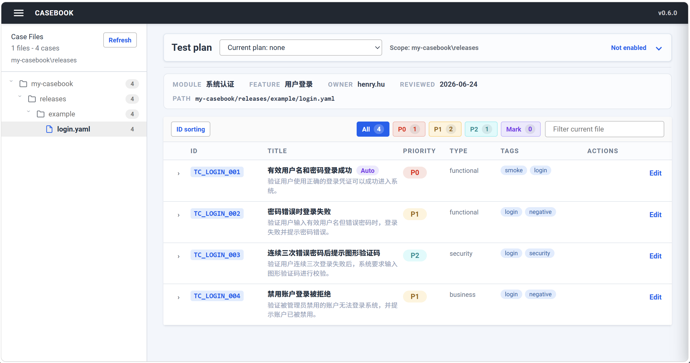

# Casebook

Casebook 是一个面向 AI 时代测试用例工作的本地工具。

它把需求文档、AI 测试设计规范、JSON Schema 约束、YAML 用例文件和可视化编辑界面连成一条完整工作流：


Casebook 的目标不是替代测试人员，而是把测试人员从重复录入中释放出来：人负责需求理解、风险判断和评审，AI 负责按规范批量生成结构化用例，Casebook 负责可视化查看和编辑。


## 设计理念

传统测试用例往往散落在表格、文档和测试管理平台里，格式难统一，版本难追踪，AI 也很难稳定复用。

Casebook 将用例工程化：

- 用 `docs/requirements/` 承载需求输入。
- 用 `.agents/skills/` 固化测试设计方法。
- 用 `schema/` 固化结构约束。
- 用 `releases/` 存放可版本化的 YAML 用例。
- 用本地 Web UI 完成审阅、标记、编辑和执行。

这让测试用例变成可以被 AI 生成、被 schema 校验、被 Git 管理、被人高效评审和执行的工程资产。


## 核心能力

- 一条命令创建标准 Casebook 用例项目。
- 将需求文档放入 `docs/requirements/`，让 AI 按项目技能包生成测试用例。
- 使用 `schema/test-case-schema.json` 约束 YAML 用例格式。
- 在本地 Web UI 中浏览、筛选、展开、标记和编辑 YAML 用例。
- 按启动目录创建测试计划，记录用例通过、失败、阻塞和执行备注。
- 使用 `casebook report` 从测试计划 JSON 生成 HTML 测试报告。
- 保存编辑时直接回写原始 YAML 文件。
- 使用 `ruamel.yaml` 尽量保留 YAML 注释、字段顺序、缩进和 inline list 风格。
- 将标记状态保存在 `.casebook/marks.json`，不污染用例文件本身。
- 监听 YAML 文件变化，并通知浏览器刷新。

## 安装

Casebook 需要 Python 3.10 或更高版本。

在本仓库中安装：

```bash
pip install casebook
```

安装后可以使用：

```bash
casebook --help
                                                                                              
 Usage: casebook [OPTIONS] COMMAND [ARGS]...                                                   
                                                                                               
 Render, review, and edit YAML test cases locally.                                             
                                                                                               
╭─ Options ───────────────────────────────────────────────────────────────────────────────────╮
│ --version          Show the Casebook version and exit.                                      │
│ --help             Show this message and exit.                                              │
╰─────────────────────────────────────────────────────────────────────────────────────────────╯
╭─ Commands ──────────────────────────────────────────────────────────────────────────────────╮
│ serve  Start the local Casebook web UI.                                                     │
│ init   Create a new Casebook test case project.                                             │
│ report Generate an HTML test report from a test run JSON file.                              │
╰─────────────────────────────────────────────────────────────────────────────────────────────╯

```

## 快速开始

创建一个新的 Casebook 项目：

```bash
casebook init my-casebook
cd my-casebook
```

启动本地用例工作台。推荐按需求目录或版本目录启动，避免历史需求互相干扰：

```bash
casebook serve releases/example
```

默认地址：

```text
http://127.0.0.1:8089
```

也可以自动打开浏览器：

```bash
casebook serve releases/example --open
```

指定端口：

```bash
casebook serve releases/example --port 8090
```

## 初始化项目

`casebook init <project>` 会创建一个完整的用例项目脚手架：

```text
my-casebook/
  AGENTS.md
  .agents/
    skills/
      casebook-test-cases/
        SKILL.md
  .vscode/
    settings.json
  docs/
    requirements/
      login.md
  releases/
    example/
      login.yaml
  schema/
    test-case-schema.json
```

这些文件分别负责：

- `docs/requirements/login.md`：示例需求文档。
- `releases/example/login.yaml`：由示例需求反向配套的 YAML 测试用例。
- `schema/test-case-schema.json`：测试用例结构约束。
- `.agents/skills/casebook-test-cases/SKILL.md`：AI 生成用例时需要遵循的技能包。
- `AGENTS.md`：项目根目录 AI 入口，提示 AI 读取技能包和 schema。
- `.vscode/settings.json`：让 VS Code YAML 插件自动关联 schema。

如果目标目录中已经存在同名文件，`init` 默认跳过，不会覆盖：

```bash
casebook init my-casebook
```

需要重置脚手架文件时，可以使用：

```bash
casebook init my-casebook --force
```

## AI 用例生成工作流

推荐工作方式：

1. 将产品需求、接口说明、交互规则或业务背景放入 `docs/requirements/`。
2. 让 AI 阅读 `AGENTS.md` 和 `.agents/skills/casebook-test-cases/SKILL.md`。
3. AI 根据需求、技能包和 `schema/test-case-schema.json` 生成 YAML 用例。
4. 将真实项目用例写入 `releases/<版本或模块>/<功能>.yaml`。
5. 使用 `casebook serve releases/<需求目录>` 查看、标记、编辑和执行当前需求范围内的用例。

示例目录中的 `releases/example/` 只用于脚手架演示。真实项目用例建议放在更明确的目录中，例如：

```text
releases/v1-auth/login.yaml
releases/v5-user-backend/package-management.yaml
```

使用时建议直接启动当前需求或版本目录：

```bash
casebook serve releases/v1-auth
casebook serve releases/v5-user-backend
```

## 用例格式

Casebook 读取符合以下结构的 YAML 文件：

```yaml
metadata:
  module: "系统认证"
  feature: "用户登录"
  owner: "qa"
  last_reviewed: "2026-06-24"
  tags: [auth, login]

test_cases:
  - id: "TC_LOGIN_001"
    title: "有效用户名和密码登录成功"
    description: "验证用户使用正确的登录凭证可以成功进入系统。"
    priority: "P0"
    type: "functional"
    preconditions:
      - 用户已注册并处于正常可登录状态
    steps:
      - 输入有效用户名和对应密码
      - 点击登录按钮
    expected_results:
      - 登录成功，进入系统首页
      - 显示当前用户姓名和欢迎信息
    tags: [smoke, login]
    auto: true
```

字段约束以 `schema/test-case-schema.json` 为准。默认支持的优先级：

```text
P0, P1, P2
```

默认支持的类型：

```text
functional, ui, security, performance, accessibility, business, other, data-consistency
```

## 本地工作台

启动后，Casebook 提供一个本地 Web UI：



- 左侧按目录展示 YAML 用例文件。
- 中间展示当前文件的用例列表、统计、优先级和标签。
- 用例行可以展开，直接查看前置条件、步骤和预期结果。
- 可以用 Mark 标记需要关注或后续修改的用例。
- 测试计划作为全局功能显示在工作区顶部，默认折叠，不影响用例评审。
- 选择或创建测试计划后，可以逐条记录 Pass、Fail、Block。
- 可以完成测试计划，并填写测试环境和测试人员。
- 测试计划面板实时显示当前启动目录的用例总数、进度条、通过数、失败数、阻塞数和未执行数。
- 展开用例后可以记录执行备注。
- 点击 Edit 打开右侧编辑抽屉，并保存回 YAML 文件。

Casebook 会根据文件修改时间做编辑冲突检查。如果 YAML 文件在页面加载后被外部修改，保存时会提示冲突，避免覆盖他人的改动。

## 测试计划与用例执行

Casebook 将执行数据保存在独立文件中，不写入 YAML 用例定义。

```text
test-runs/<run-id>.json
```

测试计划不是必选项。用例评审时可以完全不启用测试计划；需要进入执行阶段时，再展开顶部测试计划面板并创建或选择计划。

测试计划绑定当前 `casebook serve <目录>` 的启动目录。比如：

```bash
casebook serve releases/v1-auth
```

此时创建的测试计划只属于 `releases/v1-auth`，不会混入其他需求目录的计划。

每个测试计划会记录名称、范围、开始时间、完成时间和每条用例的执行结果。执行过程中，最近一次执行或备注更新时间会写入 `completed_at`；完成计划时，测试环境默认是 `测试环境`，测试人员默认来自当前启动范围内 YAML 文件的 `owner`，多个 owner 使用逗号分隔。

用例结果以 `文件路径#用例ID` 作为 key：

```json
{
  "run": {
    "id": "run-20260625093000-login-smoke",
    "name": "登录冒烟测试",
    "status": "completed",
    "scope": ["releases/v1-auth"],
    "environment": "测试环境",
    "tester": "qa",
    "started_at": "2026-06-25T01:30:00+00:00",
    "completed_at": "2026-06-25T02:30:00+00:00"
  },
  "results": {
    "releases/v1-auth/login.yaml#TC_LOGIN_001": {
      "status": "passed",
      "notes": "验证通过",
      "executed_at": "2026-06-25T01:35:00+00:00"
    }
  }
}
```

支持的执行状态：

```text
passed, failed, blocked
```

未出现在 `results` 中的用例视为未执行。

## HTML 测试报告

执行完成后，可以从测试计划 JSON 生成 HTML 报告：

```bash
casebook report test-runs/run-20260625093000-login-smoke.json
```

默认会在同目录生成同名 `.html` 文件：

```text
test-runs/run-20260625093000-login-smoke.html
```

也可以指定输出位置：

```bash
casebook report test-runs/run-20260625093000-login-smoke.json --output reports/login-smoke.html
```

报告内容包括：

- 测试计划基本信息：ID、名称、状态、范围、测试环境、测试人员、开始时间和完成时间。
- 执行概览：用例总数、已执行、已通过、失败、阻塞、待测试。
- ECharts 环形图：执行状态分布、失败/阻塞优先级分布。
- 失败用例列表。
- 阻塞用例列表。

报告 HTML 通过 CDN 引入 ECharts 渲染图表；即使图表脚本未加载，报告中的概览数字和用例列表仍然可以直接查看。

## 命令参考

创建项目：

```bash
casebook init my-casebook
```

覆盖脚手架文件：

```bash
casebook init my-casebook --force
```

启动当前需求目录：

```bash
casebook serve releases/v1-auth
```

同时扫描多个目录：

```bash
casebook serve releases/v1 releases/v2
```

指定主机和端口：

```bash
casebook serve releases/v1-auth --host 127.0.0.1 --port 8090
```

禁用文件监听：

```bash
casebook serve releases/v1-auth --no-watch
```

生成 HTML 测试报告：

```bash
casebook report test-runs/run-20260625093000-login-smoke.json
```

指定报告输出路径：

```bash
casebook report test-runs/run-20260625093000-login-smoke.json --output reports/login-smoke.html
```

## 项目状态文件

Casebook 的标记数据保存在项目根目录：

```text
.casebook/marks.json
```

示例：

```json
{
  "releases/example/login.yaml#TC_LOGIN_001": {
    "needs_update": true,
    "updated_at": "2026-06-24T02:00:00+00:00"
  }
}
```

这些状态不写入 YAML 用例文件，因此不会影响用例正文和 schema 校验。

执行数据保存在：

```text
test-runs/*.json
```

这些文件是后续生成测试报告的重要数据来源。测试计划按启动目录隔离，适合围绕单个需求、版本或模块做执行统计。

## 开发

本地开发安装：

```bash
pip install -e .
```

创建演示项目：

```bash
casebook init /tmp/casebook-demo
cd /tmp/casebook-demo
casebook serve releases/example
```

在源码模式下也可以直接运行：

```bash
python -m casebook.cli init /tmp/casebook-demo
python -m casebook.cli serve releases/example
```
