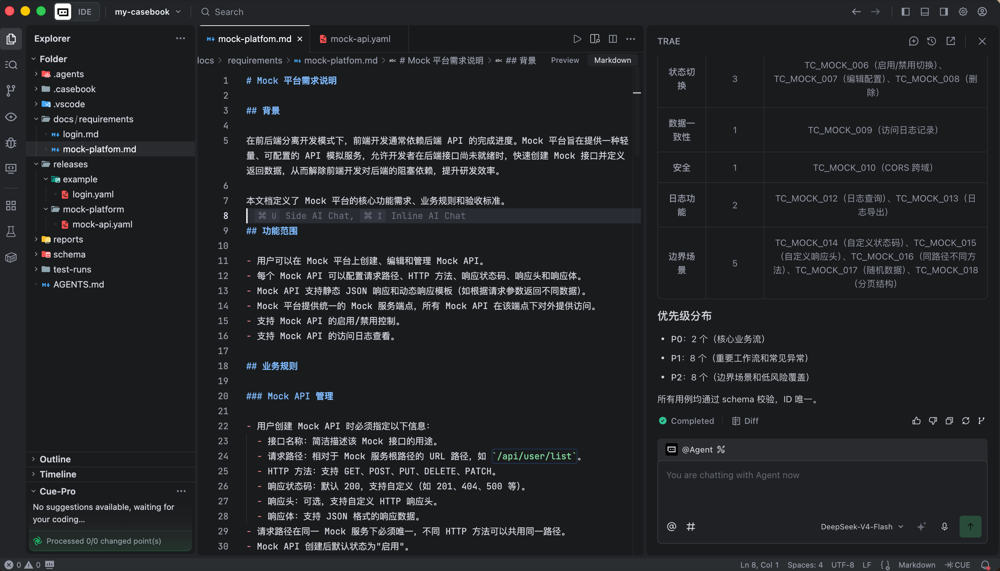

# Casebook 使用说明

本文档承接 README 中不适合展开太长的使用细节，覆盖 AI Agent 生成用例、测试计划、项目状态文件和 HTML 测试报告。

## 使用 AI Agent 生成用例

Casebook 的推荐方式不是在页面里点击“生成用例”，而是在项目工程里让 AI Agent 直接读取需求、技能包、schema 和已有 YAML 文件，然后写入 `releases/` 目录。

这样做有几个好处：

- AI 能同时理解需求、历史用例和项目规范。
- 用例变更可以被 Git 追踪、审查和回滚。
- 新增、删除、拆分、合并、重构用例可以一次性完成，不需要人在页面里逐条维护。
- `schema/test-case-schema.json` 可以约束 AI 输出，减少格式漂移。

### AI 需要读取哪些文件

每次让 AI Agent 生成或维护用例时，建议明确让它读取这些文件：

| 文件 | 作用 |
| --- | --- |
| `AGENTS.md` | 告诉 AI 当前项目如何工作，以及应该引用哪个技能包 |
| `.agents/skills/casebook-test-cases/SKILL.md` | 告诉 AI 如何理解需求、设计用例、写得像测试人员 |
| `schema/test-case-schema.json` | 约束 YAML 用例结构，确保输出可被 Casebook 读取 |
| `docs/requirements/` | 需求、接口、业务规则和验收标准 |
| `releases/` | 已有 YAML 用例，也是 AI 写入和维护的目标目录 |

### 生成用例

新需求第一次生成用例时，可以直接把下面这段提示词给 AI Agent：

```text
请阅读以下文件：
- AGENTS.md
- .agents/skills/casebook-test-cases/SKILL.md
- schema/test-case-schema.json
- docs/requirements/login.md

请根据需求生成 YAML 测试用例，写入：
releases/v1-auth/login.yaml

要求：
- 严格符合 schema/test-case-schema.json。
- 用例要覆盖正常场景、异常场景、边界条件、权限/状态相关场景。
- 优先级使用 P0/P1/P2。
- 用例标题要像测试人员写的，不要像需求标题。
- 步骤和预期结果要具体，可执行、可评审。
- 如果需求信息不足，请在生成前指出缺失信息，并基于合理假设继续生成。
```



生成完成后，启动当前需求目录进行评审：

```bash
casebook serve releases/v1-auth
```

### 生成后的检查清单

AI Agent 完成修改后，建议做一次检查：

- YAML 文件是否在 `releases/<需求或版本目录>/` 下。
- 是否符合 `schema/test-case-schema.json`。
- 是否覆盖正常场景、异常场景、边界条件和关键业务规则。
- 用例标题是否清晰，步骤是否可执行，预期结果是否可验证。
- 是否存在重复用例、空泛用例或与需求无关的用例。
- 是否可以通过 `casebook serve <目录>` 在本地工作台正常浏览。

Casebook 的核心思路是：AI Agent 负责生成和维护 YAML，人负责评审、判断和执行。这样测试用例不再是散落在平台里的表格，而是可被 AI 理解、可被 schema 校验、可被 Git 管理的工程资产。

## 测试计划与用例执行

Casebook 将执行数据保存在独立文件中，不写入 YAML 用例定义。

```text
test-runs/<run-id>.json
```

测试计划不是必选项。用例评审时可以完全不启用测试计划；需要进入执行阶段时，再展开顶部测试计划面板并创建或选择计划。

测试计划绑定当前 `casebook serve <目录>` 的启动目录。比如：

```bash
casebook serve releases/v1-auth
```

此时创建的测试计划只属于 `releases/v1-auth`，不会混入其他需求目录的计划。

每个测试计划会记录名称、范围、开始时间、完成时间和每条用例的执行结果。执行过程中，最近一次执行或备注更新时间会写入 `completed_at`；完成计划时，测试环境默认是 `测试环境`，测试人员默认来自当前启动范围内 YAML 文件的 `owner`，多个 owner 使用逗号分隔。

用例结果以 `文件路径#用例ID` 作为 key：

```json
{
  "run": {
    "id": "run-20260625093000-login-smoke",
    "name": "登录冒烟测试",
    "status": "completed",
    "scope": ["releases/v1-auth"],
    "environment": "测试环境",
    "tester": "qa",
    "started_at": "2026-06-25T01:30:00+00:00",
    "completed_at": "2026-06-25T02:30:00+00:00"
  },
  "results": {
    "releases/v1-auth/login.yaml#TC_LOGIN_001": {
      "status": "passed",
      "notes": "验证通过",
      "executed_at": "2026-06-25T01:35:00+00:00"
    }
  }
}
```

支持的执行状态：

```text
passed, failed, blocked
```

未出现在 `results` 中的用例视为未执行。


## 项目状态文件

Casebook 的标记数据保存在项目根目录：

```text
.casebook/marks.json
```

示例：

```json
{
  "releases/example/login.yaml#TC_LOGIN_001": {
    "needs_update": true,
    "updated_at": "2026-06-24T02:00:00+00:00"
  }
}
```

这些状态不写入 YAML 用例文件，因此不会影响用例正文和 schema 校验。

执行数据保存在：

```text
test-runs/*.json
```

这些文件是后续生成测试报告的重要数据来源。测试计划按启动目录隔离，适合围绕单个需求、版本或模块做执行统计。


## HTML 测试报告

执行完成后，可以从测试计划 JSON 生成 HTML 报告：

```bash
casebook report test-runs/run-20260625093000-login-smoke.json
```

默认会在同目录生成同名 `.html` 文件：

```text
test-runs/run-20260625093000-login-smoke.html
```

也可以指定输出位置：

```bash
casebook report test-runs/run-20260625093000-login-smoke.json --output reports/login-smoke.html
```

报告内容包括：

- 测试计划基本信息：ID、名称、状态、范围、测试环境、测试人员、开始时间和完成时间。
- 执行概览：用例总数、已执行、已通过、失败、阻塞、待测试。
- ECharts 环形图：执行状态分布、失败/阻塞优先级分布。
- 失败用例列表。
- 阻塞用例列表。

报告 HTML 通过 CDN 引入 ECharts 渲染图表；即使图表脚本未加载，报告中的概览数字和用例列表仍然可以直接查看。
