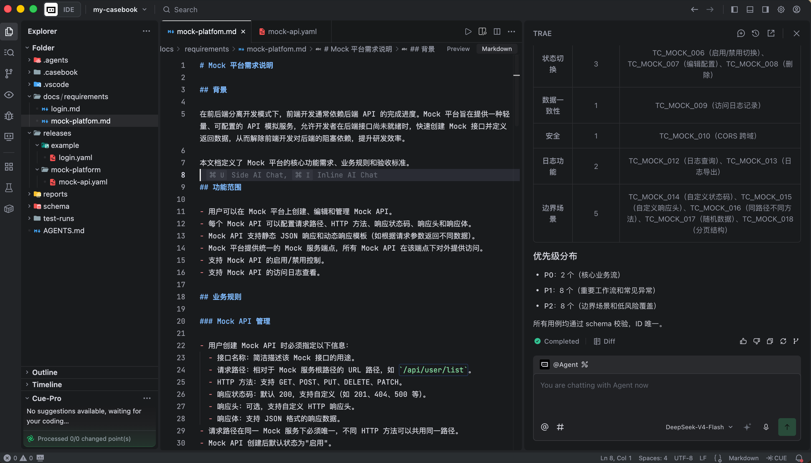

# Casebook 使用说明

本文档承接 README 中不适合展开太长的使用细节，覆盖 AI Agent 生成用例、用例 ID 重排、静态 HTML 用例导出、测试计划、项目状态文件、HTML 测试报告和 AI Agent 生成测试过程记录。`0.8.0` 将本地工作台、导出页面和测试报告统一为简报式设计；`0.9.0` 进一步增加用例 ID 复制、计划归属、将已有用例加入计划、计划模式安全重排 ID、多前缀独立编号和启动目录校验。

## 使用 AI Agent 生成用例

Casebook 的推荐方式不是在页面里点击“生成用例”，而是在项目工程里让 AI Agent 直接读取需求、技能包、schema 和已有 YAML 文件，然后写入 `releases/` 目录。

这样做有几个好处：

- AI 能同时理解需求、历史用例和项目规范。
- 用例变更可以被 Git 追踪、审查和回滚。
- 新增、删除、拆分、合并、重构用例可以一次性完成，不需要人在页面里逐条维护。
- `schema/test-case-schema.json` 可以约束 AI 输出，减少格式漂移。

### AI 需要读取哪些文件

每次让 AI Agent 生成或维护用例时，建议明确让它读取这些文件：

| 文件 | 作用 |
| --- | --- |
| `AGENTS.md` | 告诉 AI 当前项目如何工作，以及应该引用哪个技能包 |
| `.agents/skills/casebook-test-cases/SKILL.md` | 告诉 AI 如何理解需求、设计用例、写得像测试人员 |
| `schema/test-case-schema.json` | 约束 YAML 用例结构，确保输出可被 Casebook 读取 |
| `docs/requirements/` | 需求、接口、业务规则和验收标准 |
| `releases/` | 已有 YAML 用例，也是 AI 写入和维护的目标目录 |

### 生成用例

新需求第一次生成用例时，可以直接把下面这段提示词给 AI Agent：

```text
请阅读以下文件：
- AGENTS.md
- .agents/skills/casebook-test-cases/SKILL.md
- schema/test-case-schema.json
- docs/requirements/login.md

请根据需求生成 YAML 测试用例，写入：
releases/v1-auth/login.yaml

要求：
- 严格符合 schema/test-case-schema.json。
- 用例要覆盖正常场景、异常场景、边界条件、权限/状态相关场景。
- 优先级使用 P0/P1/P2。
- 用例标题要像测试人员写的，不要像需求标题。
- 步骤和预期结果要具体，可执行、可评审。
- 如果需求信息不足，请在生成前指出缺失信息，并基于合理假设继续生成。
```



生成完成后，启动当前需求目录进行评审：

```bash
casebook serve releases/v1-auth
```

`casebook serve` 会在启动 Web 服务前校验每个扫描目录。目录不存在、路径无效或目标不是目录时会直接报错并退出。例如：

```text
casebook serve: directory not found: releases/v1-auth
```

不传目录时使用默认的 `releases`，并执行相同校验。这样可以尽早发现目录拼写错误，避免误以为一个空工作区已经正常启动。

### 生成后的检查清单

AI Agent 完成修改后，建议做一次检查：

- YAML 文件是否在 `releases/<需求或版本目录>/` 下。
- 是否符合 `schema/test-case-schema.json`。
- 是否覆盖正常场景、异常场景、边界条件和关键业务规则。
- 用例标题是否清晰，步骤是否可执行，预期结果是否可验证。
- 是否存在重复用例、空泛用例或与需求无关的用例。
- 是否可以通过 `casebook serve <目录>` 在本地工作台正常浏览。

Casebook 的核心思路是：AI Agent 负责生成和维护 YAML，人负责评审、判断和执行。这样测试用例不再是散落在平台里的表格，而是可被 AI 理解、可被 schema 校验、可被 Git 管理的工程资产。

## 用例评审与计划归属

本地工作台负责评审和执行已有 YAML 用例，不提供在页面中新增 YAML 用例的入口。需要新增、删除、拆分或合并用例时，应把需求和目标用例 ID 交给 AI Agent，由 AI 直接修改 `releases/` 下的文件。

`0.9.0` 中，用例 ID 显示为可复制按钮。点击 ID 后会写入剪贴板，便于准确告诉 AI 要修改哪条用例，避免只凭标题定位同名或相近场景。

用例列表的 `Plans` 列展示该用例当前属于哪些测试计划：

- 进行中的计划使用主要强调色。
- 已完成计划继续展示为历史归属，但保持只读。
- 没有计划归属时显示 `—`。

要把已有用例加入计划：

1. 确保当前没有选择测试计划，使工作台处于评审模式。
2. 点击目标用例的 `Edit`。
3. 在 `Add to plan` 下拉框中选择一个进行中的计划。
4. 点击 `Add to plan`。

下拉框不会显示已经包含该用例的计划，也不会显示已完成计划。加入操作只把 `文件路径#用例ID` 写入所选计划的 `case_scope`，不会修改 YAML；该用例在计划中从 `Untested` 开始，已有其他用例的执行结果保持不变。

展开用例详情时，大屏布局会让左侧 Preconditions、Steps、Expected Results 卡片自动匹配右侧评审或执行面板高度。面板宽度不足时切换为上下排列，避免为了等高压缩内容。

## 用例 ID 重排

用例评审和执行阶段经常会由 AI Agent 删除、插入、拆分或调整用例。Casebook 推荐保持 YAML 中的用例顺序不变，再按当前文件顺序重新整理用例 ID。

重排范围是当前 YAML 文件，不会跨文件处理。`0.9.0` 支持一个文件中存在多种 ID 前缀：每种前缀以第一次出现的 ID 为起点，并保留第一次出现时的数字位数；同一前缀即使被其他前缀隔开，也会继续自己的编号序列。

例如：

```text
TC_SUB_INVOICE_003
TC_SUB_INVOICE_009
TC_NOTFOUND_CONFIG_001
TC_NOTFOUND_CONFIG_006
TC_SUB_INVOICE_015
```

重排后会变成：

```text
TC_SUB_INVOICE_003
TC_SUB_INVOICE_004
TC_NOTFOUND_CONFIG_001
TC_NOTFOUND_CONFIG_002
TC_SUB_INVOICE_005
```

命令行重排：

```bash
casebook renumber releases/example/login.yaml
```

本地工作台重排：

- 打开某个 YAML 文件。
- 点击用例列表上方的 `ID sorting`。
- 如果当前没有选择计划，只重排 YAML ID 并迁移该文件的 Mark 标记。
- 如果选择了进行中的计划，Casebook 还会同步更新当前计划的 `case_scope` 和 `results`。

计划模式重排会根据旧 ID 到新 ID 的映射保留已有执行数据，包括状态、Notes、Actual Result、Defects、Screenshots 和执行时间。已从 YAML 删除的用例会退出当前计划范围；新生成但尚未明确加入计划的用例不会被自动吸收。已完成计划保持只读，因此不能进行 ID 重排。

重排时，当前文件里的 Mark 标记会按旧 ID 到新 ID 自动迁移，避免评审标记丢失。

> 计划迁移针对当前选中的进行中计划。如果同一批用例同时属于多个需要继续执行的计划，应在调整 YAML 和 ID 前先确认这些计划的维护策略，避免修改已冻结的历史范围。

## 静态 HTML 用例导出

`casebook serve` 适合本机评审和执行，但会议室电脑、开发冒烟用例交付、离线分享等场景更适合直接打开一个静态 HTML 文件。

导出整个需求或版本目录：

```bash
casebook export releases/v1-auth
```

目录会默认聚合为一个 HTML 文件，命名规则类似：

```text
releases/v1-auth -> casebook-v1-auth.html
```

导出单个 YAML 文件：

```bash
casebook export releases/v1-auth/login.yaml
```

单个 YAML 默认输出同名 HTML：

```text
releases/v1-auth/login.yaml -> releases/v1-auth/login.html
```

指定输出位置：

```bash
casebook export releases/v1-auth --output login-review.html
```

按标签或优先级导出部分用例：

```bash
casebook export releases/v1-auth --tag smoke
casebook export releases/v1-auth --priority P0
casebook export releases/v1-auth --tag smoke --priority P0
```

`--tag` 和 `--priority` 都可以重复传入，也支持逗号分隔：

```bash
casebook export releases/v1-auth --tag smoke --tag api
casebook export releases/v1-auth --priority P0,P1
```

导出的 HTML 是偏评审视图的只读用例包，包含：

- 文件元信息、用例数量和优先级统计。
- 用例 ID、标题、描述、优先级、类型和标签。
- 前置条件、步骤和预期结果。
- 页面内搜索、优先级筛选、标签筛选、展开/收起。
- 每条用例的 `Mark` 标记和评审备注。

`0.8.0` 的导出页面采用与本地工作台一致的简报式布局，重点突出项目概览、风险、优先级分布和用例清单，同时支持宽屏与窄屏阅读。

导出的 HTML 不读取项目中的 `.casebook/marks.json`，因此不会把本地工作台的 Mark 状态带出去。HTML 中的评审标记和备注保存在浏览器 localStorage 中，适合会议室电脑临时评审；评审结束后可以点击 `Export review notes` 下载 JSON，把备注带回项目继续处理。

## 测试计划与用例执行

Casebook 将执行数据保存在独立文件中，不写入 YAML 用例定义。

```text
test-runs/<run-id>.json
```

测试计划不是必选项。用例评审时可以完全不启用测试计划；需要进入执行阶段时，点击顶部 `Manage plan` 打开右侧抽屉，在抽屉中创建或选择计划。主页面只展示当前计划摘要和执行进度；没有选择计划时，进度条与统计卡片自动隐藏。

当前选择会按 `casebook serve <目录>` 的启动范围保存在浏览器本地。刷新页面后，Casebook 会自动恢复该范围上一次选择的计划；如果计划已被删除或不再属于当前范围，则自动回到未选择状态。手动选择 `Current plan: none` 会清除该范围的保存状态。

测试计划绑定当前 `casebook serve <目录>` 的启动目录。比如：

```bash
casebook serve releases/v1-auth
```

此时创建的测试计划只属于 `releases/v1-auth`，不会混入其他需求目录的计划。

每个测试计划会记录名称、范围、模式、用例范围、用例快照、开始时间、完成时间和每条用例的执行结果。执行过程中，最近一次执行、备注或缺陷链接更新时间会写入 `completed_at`；完成计划时，测试环境默认是 `Test environment`，测试人员默认来自当前启动范围内 YAML 文件的 `owner`，多个 owner 使用逗号分隔。

创建测试计划时支持两种模式：

- `Full run`：全量执行当前 `casebook serve <目录>` 启动范围下的所有用例。
- `Retest failed/blocked/deferred`：基于一个已完成的来源测试计划，只带入上一轮 `failed`、`blocked`、`deferred` 的用例。本轮不会继承上一轮结果，所有带入用例都会从 `untested` 开始重新执行。

选择计划后，工作台进入计划模式：

- 用例列表显示执行结果操作，并隐藏 Edit，避免执行过程中误改 YAML 定义。
- Actions 列显示 `Passed`、`Failed`、`Blocked`、`Deferred` 等状态选择。
- 展开用例后可以记录 Notes、Actual Result、Defects 和截图证据。
- 主页面持续显示 Cases、Passed、Failed、Blocked、Deferred、Untested 统计。
- `ID sorting` 可同步重排当前 YAML 文件，并迁移当前计划的范围与既有执行结果；已完成计划会禁用该操作。

如果 AI Agent 在计划执行过程中新增了一条 YAML 用例，该用例不会自动进入既有计划。先取消当前计划选择，打开新用例的 Edit 抽屉，通过 `Add to plan` 明确选择目标计划；再次进入计划后，新用例会以 `Untested` 状态出现。

完成测试计划前，本轮 `case_scope` 内的每条用例都必须被处理过。也就是说，用例状态必须是 `passed`、`failed`、`blocked` 或 `deferred` 之一；仍然存在 `untested` 用例时，`Complete plan & generate report` 会拒绝完成。

完成计划与生成报告现在是一个连续操作：

1. 在测试计划抽屉中填写 Environment 和 Tester。
2. 输入 Test report name；支持中文名称，也可以直接填写 `.html` 文件名。
3. 点击 `Complete plan & generate report`。
4. Casebook 完成计划，将 HTML 写入 `reports/`，并显示 `Open generated report` 链接。

如果 `reports/` 不存在，Casebook 会自动创建。已完成的计划仍可输入新的报告名称，点击 `Generate report` 重新生成，不会重复修改计划完成状态。

每次成功生成后，报告名称、文件名、路径和生成时间会记录在对应测试计划的 `run.reports` 中，并在抽屉里按名称列出。再次输入同名报告会覆盖 `reports/` 中原有的 HTML，并更新原报告记录；不同名称则保留为多条可独立打开的报告。

用例结果以 `文件路径#用例ID` 作为 key：

```json
{
  "schema_version": "2.0",
  "run": {
    "id": "run-20260625093000-login-smoke",
    "name": "Login smoke test",
    "status": "completed",
    "mode": "full",
    "scope": ["releases/v1-auth"],
    "case_scope": [
      "releases/v1-auth/login.yaml#TC_LOGIN_001"
    ],
    "environment": "Test environment",
    "tester": "qa",
    "started_at": "2026-06-25T01:30:00+00:00",
    "completed_at": "2026-06-25T02:30:00+00:00"
  },
  "cases": {
    "releases/v1-auth/login.yaml#TC_LOGIN_001": {
      "file_path": "releases/v1-auth/login.yaml",
      "id": "TC_LOGIN_001",
      "title": "有效用户名和密码登录成功",
      "priority": "P0",
      "type": "functional",
      "tags": ["login", "smoke"]
    }
  },
  "results": {
    "releases/v1-auth/login.yaml#TC_LOGIN_001": {
      "status": "passed",
      "notes": "Passed",
      "actual_result": "成功进入系统首页",
      "defects": [],
      "executed_at": "2026-06-25T01:35:00+00:00"
    }
  }
}
```

`schema_version: "2.0"` 将用例定义与执行证据分开保存：

- `run.case_scope` 固定本轮需要执行的用例及顺序。
- `cases` 保存创建计划或加入计划时的轻量用例快照，包含路径、ID、标题、优先级、类型和标签。
- `results` 只保存状态、备注、实际结果、缺陷、截图和执行时间等执行证据。
- HTML 测试报告优先读取 `cases` 快照，因此执行结束后即使 YAML 用例被修改、重排或删除，历史报告仍能还原执行当时的信息。

示例展示的是核心字段。启用截图、单用例测试人员或内部更新时间时，`results` 中仍可能包含 `screenshots`、`tester`、`updated_at` 等兼容字段，现有工作台和报告会继续识别。

旧版计划文件不需要手工迁移。缺少 `schema_version` 或 `cases` 的文件仍可读取和生成报告，Casebook 会继续从当前 YAML 中补充用例信息。

支持的执行状态：

```text
passed, failed, blocked, deferred
```

未出现在 `results` 中的用例视为未执行。


## 项目状态文件

Casebook 的标记数据保存在项目根目录：

```text
.casebook/marks.json
```

示例：

```json
{
  "releases/example/login.yaml#TC_LOGIN_001": {
    "needs_update": true,
    "updated_at": "2026-06-24T02:00:00+00:00"
  }
}
```

这些状态不写入 YAML 用例文件，因此不会影响用例正文和 schema 校验。

执行数据保存在：

```text
test-runs/*.json
```

这些文件是后续生成 HTML 测试报告、测试过程记录和上线评审材料的重要数据来源。新建计划使用 `2.0` 数据结构，将稳定的用例快照与执行结果分开保存；旧版计划文件仍保持兼容。测试计划按启动目录隔离，适合围绕单个需求、版本或模块做执行统计。

从工作台生成的报告保存在：

```text
reports/*.html
```

`reports/` 会在第一次生成报告时自动创建。报告文件是独立 HTML，可以直接打开或分发。

## HTML 测试报告

### 从测试计划抽屉生成

推荐在本地工作台中完成计划并同步生成报告：

```text
Manage plan
  -> Complete plan
  -> Test report name
  -> Complete plan & generate report
  -> Open generated report
```

报告名称会被转换为安全的 HTML 文件名，并写入项目根目录的 `reports/`。已经完成的计划可以使用 `Generate report` 再次生成报告。

### 从命令行生成

也可以从测试计划 JSON 生成 HTML 报告：

```bash
casebook report test-runs/run-20260625093000-login-smoke.json
```

默认会在同目录生成同名 `.html` 文件：

```text
test-runs/run-20260625093000-login-smoke.html
```

也可以指定输出位置：

```bash
casebook report test-runs/run-20260625093000-login-smoke.json --output reports/login-smoke.html
```

报告内容包括：

- 测试计划基本信息：ID、名称、状态、范围、测试环境、测试人员、开始时间和完成时间。
- Execution Summary：用例总数、已执行、通过、失败、阻塞、延期和待测试，每种状态使用独立配色。
- Quality Signals：执行状态分布、通过率和失败/阻塞优先级分布。
- Attention Required：Failed Cases 和 Blocked Cases 的重点关注列表。
- Execution Details：默认收起的完整用例清单，主行显示 Case、Title、Priority 和 Result。
- 展开执行明细后，可以查看 File、Notes、Actual Result、Defects、Screenshots 和 Executed At。
- 白色简报式页脚和适配宽屏、平板、窄屏的响应式布局。

报告 HTML 通过 CDN 引入 ECharts 渲染图表；即使图表脚本未加载，报告中的概览数字和用例列表仍然可以直接查看。

## AI Agent 生成测试过程记录

测试过程记录不适合由一个固定 CLI 模板硬生成。真实需求和执行方式经常不同：有的需要 SQL，有的需要接口请求响应，有的需要前端截图，有的更像上线评审记录。Casebook 的边界是保存结构化证据，AI Agent 的边界是根据你的目标和模板组织文档。

项目提供了专门的技能包：

```text
.agents/skills/casebook-test-process-record/SKILL.md
```

也提供了一个可参考但不强制的模板：

```text
docs/templates/l2-test-process-record.md
```

推荐向 AI Agent 提供这些关键信息：

- **需求在哪里**：例如 `docs/requirements/login.md`。
- **用例在哪里**：例如 `releases/example/` 或某个 YAML 文件。
- **执行结果在哪里**：例如 `test-runs/run-20260625093000-login-smoke.json`。
- **你想要什么格式**：例如 `docs/templates/l2-test-process-record.md`，或一份已有过程记录。

可以直接使用这样的提示词：

```text
请使用 .agents/skills/casebook-test-process-record/SKILL.md 生成测试过程记录。

需求文档：
docs/requirements/login.md

测试用例：
releases/example/

执行结果：
test-runs/run-20260625093000-login-smoke.json

截图证据：
test-runs/screenshots/run-20260625093000-login-smoke/

输出格式参考：
docs/templates/l2-test-process-record.md

输出到：
docs/test-logs/login-smoke-test-process-record.md
```

AI Agent 生成文档时应该读取：

- `docs/requirements/`：理解业务背景和核心逻辑。
- `releases/`：理解设计过的测试场景、步骤和预期结果。
- `test-runs/*.json`：读取真实执行状态、实际结果、备注、缺陷链接和截图元数据。
- `test-runs/screenshots/<run-id>/`：引用或查看截图证据。
- 用户指定的模板或样例：决定最终文档结构。

生成原则：

- 不编造执行证据。
- 不强行套固定模板。
- 失败、阻塞、延期、未执行用例必须清晰可见。
- 有 `actual_result`、`notes`、`defects`、`screenshots` 的内容不能遗漏。
- 缺少 SQL、API Payload、日志、测试环境、人工结论等信息时，标记为 `待补充`。
- 输出到 `docs/test-logs/`，除非用户指定其他位置。
